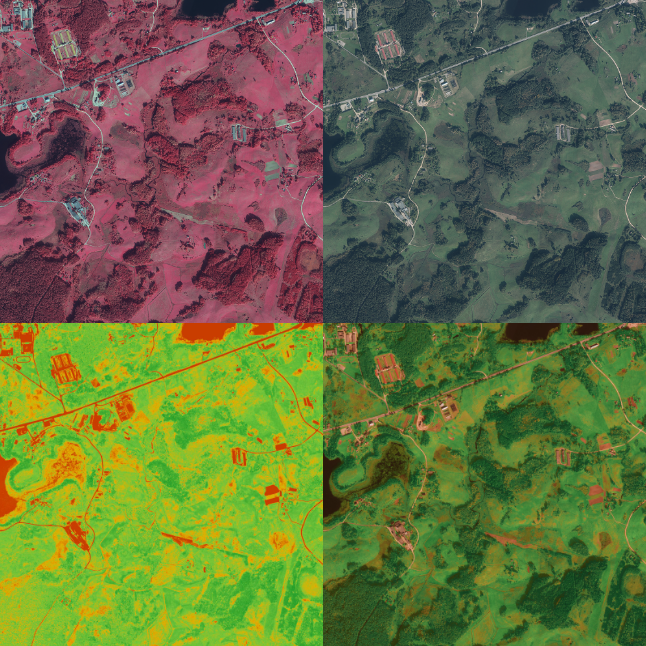

Krišjānis Petručeņa / komanda "One Lone Coder" 

Atvērto ģeotelpisko datu hakatons skolēniem 2021

2021.10.07 - 2021.11.04

# Info par hakatonu

[Atvērto ģeotelpisko datu hakatons skolēniem 2021](https://www.lata.org.lv/skolas-2021)

## Mērķis

> Veidot sabiedrības, tostarp jauniešu, izpratni par ģeotelpisko atvērto datu nozīmīgumu inovatīvu produktu un pakalpojumu izstrādē un veicināt ģeotelpisko datu atvēršanu Latvijā, kā arī izglītot jauniešus par atvērto datu tehnoloģiju izmantošanu.

## Uzdevums

> Radoša, inovatīva un praktiska brīvo un atvērto datu izmantošana, radot sabiedrībai noderīgu produktu vai pakalpojumu, iesaistot tehnoloģijas.

## Rezultāts

> Hakatona dalībnieku sasniedzamais rezultāts ir radīt inovatīvu lietotni, kas risina sabiedrībai būtisku problēmu, izmantojot atvērtos ģeotelpiskos datus.

## Vērtēšanas kritēriji

1. Atvērto ģeotelpisko datu inovatīvs pielietojums.
2. Tehniskais izpildījums
3. Idejas dzīvotspēja
4. Projekta progress
5. Projekta prezentācija

## Pieejamo datu kopas

1. Latvijas Ģeotelpiskās informācijas aģentūras datu kopas
2. OpenStreetMap datu kopa
3. LVRTC datu kopa
4. Valsts Zemes dienests datu kopas
5. Atvērtie dati Latvijā
6. Atvērtie dati Eiropas Savienībā

